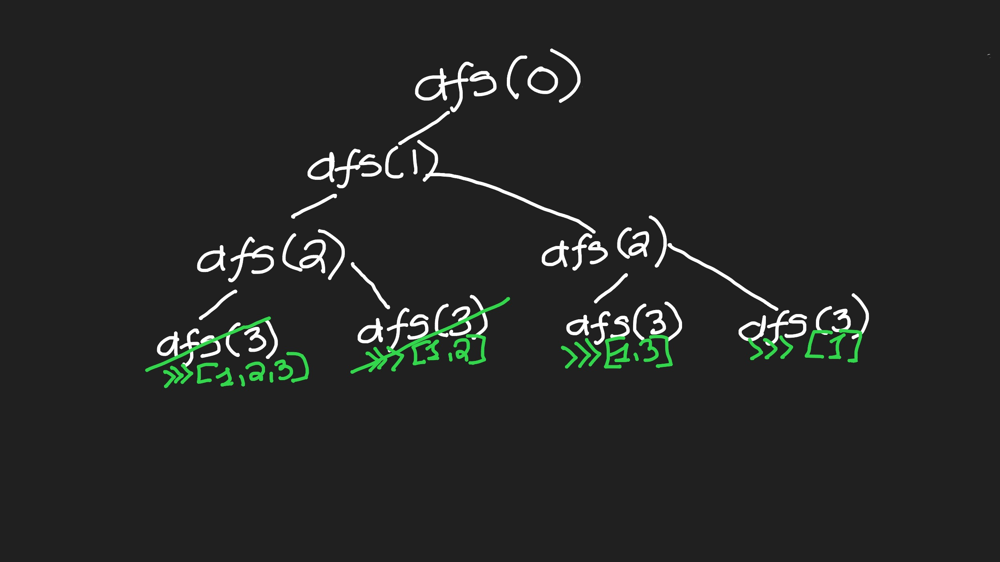

Input: nums = [1,2,3]
Output: [[],[1],[2],[1,2],[3],[1,3],[2,3],[1,2,3]]

LeetCode problem [78. Subsets](https://leetcode.com/problems/subsets/description/).

We'll use backtracking to generate all possible subsets.

The recursive calls to dfs() are a depth first search of all the possible subsets.

And note: self.subset[:] is much faster then self.subset.copy().

```python
class Solution:
    def __init__(self):
        self.output = []

    def subsets(self, nums):
        self.subset = []
        self.length = len(nums)
        def dfs(idx):
            if idx == self.length:
                self.output.append(self.subset[:])
                # self.subset = [first_num]
                return
            self.subset.append(nums[idx])
            dfs(idx+1)
            self.subset.pop(-1)
            dfs(idx+1)

        dfs(0)
        return self.output
```

<br/>

Tracing through the first half of recursive calls...


